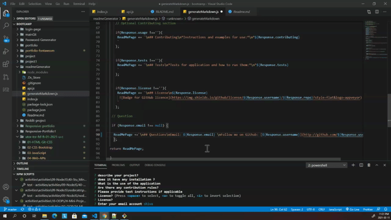

<h1 align="center"> Welcome to readme generator👋</h1>

 
   
   

## Description 
   reg

 
## ✨Demo

 ## Table of Contents
* [Description](#Description)
* [Installation](#installation)
* [Usage](#usage)
* [Contributing](#contributing )
* [Tests](#tests)
* [license](#license)
## Installation
*Steps required to install project and how to get the development environment running:*

To generate your own README, first run npm install in order to install the following npm package dependencies as specified in the package.json:

inquirer that will prompt you for your inputs from the command line
The application itself can be invoked with node index.js.
      
## 💻usage
*Instructions and examples for use:* 

 When you run node index.js, the application uses the inquirer package to prompt you in the command line with a series of questions about your GitHub and about your project.the application will generate markdown and a table of contents for the README conditionally based on your responses to the Inquirer prompts (so, if you don't answer the optional questions, such as Installation, an Installation section will not be included in your README). The README will also include badges for your GitHub repo.
      
      
## 🤝Contributing
*Contributions, issues and feature requests are welcome.* 3rt23tr2w
      
## Tests
*Tests for application and how to run them:*
*3 
      
## 📝License
 
      
## Questions
 :octocat: Find me on GitHub:[shiva-shiva](https://github.com/shiva-shiva) 
     
    ✉️ Email me with any questions: shivasabokdast@gmail.com